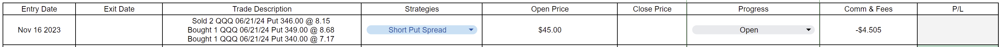
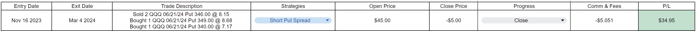
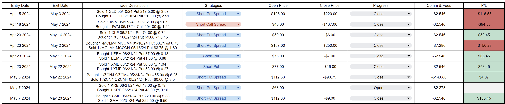
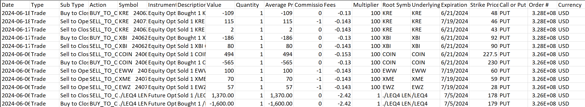

# AUTOMATING TRADING JOURNAL
## Objective

Given an existing trading journal and a trade transaction file from Tastytrade, Robinhood, and Schwab, edit the trading journal opened trades by updating the exit date, close price, progress, and commissions/fees using the trade transaction file. Also, add newly opened positions to the trade journal. Both files will be CSV. 

* Use the last transaction date if exit dates for multilegged trades are different.
* If the expiration date is less than the current date and there are no closing transactions, assume the options contract expired worthless and the close price is 0.
   * Find the expiration date using the trade journal.
* P/L will be calculated automatically in the spreadsheet.
* Transactions include stock, futures, stock options, and futures options.

<u>Example</u>

If a trade was opened and closed a few weeks later.

Using the tastytrade trade transaction file, the program should be able to detect a closed trade and update the trading journal exit date, close price, progress, and commission/fees.

<u>Trade Journal Sample</u>

<u>Trade Transaction Sample</u>

## Design Diagram

## Design Documentation
**CSVFileHandling:** A class that takes in CSV files creates a copy and reference to trading journal and trade transaction files respectively.

*  **constructor(self, journalFilePath: str, transFilePath: str)-> None** 

   Defines the filePath for trading journal and trade transaction files.
*  **createCopy(self)-> csv.writer** 

   Duplicates trade journal and export the file to the file directory of original csv file and return  csv.writer  object.
*  **createRef(self)-> csv.reader** 

   Opens trade transaction file and returns  csv.reader  object.
